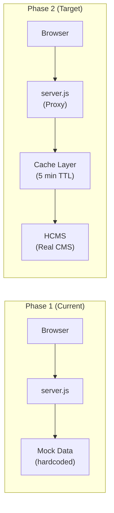
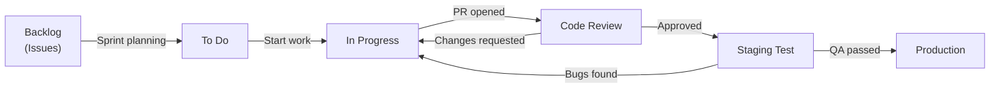

# Lộ Trình Phát Triển (Development Roadmap)

> Tài liệu theo dõi tiến độ và kế hoạch phát triển **FPT Internet Landing Page**

---

## 1. Trạng Thái Hiện Tại

**Phiên bản:** 1.0.0  
**Ngày cập nhật:** 2026-07-03  
**Trạng thái tổng thể:** Phase 1 — Hoàn thành ✅

---

## 2. Milestone Overview

| Phase | Tên | Trạng thái | Thời gian | Mô tả |
|-------|-----|------------|-----------|-------|
| **Phase 1** | Static Landing Page | ✅ Hoàn thành | Q2 2026 | MVP với mock API |
| **Phase 2** | CMS Integration | 🔄 Đang phát triển | Q3 2026 | Kết nối HCMS thật |
| **Phase 3** | SEO & Analytics | 📋 Kế hoạch | Q3 2026 | SEO optimization, GA4 |
| **Phase 4** | A/B Testing | 📋 Kế hoạch | Q4 2026 | Tối ưu conversion rate |
| **Phase 5** | Performance | 📋 Kế hoạch | Q4 2026 | Core Web Vitals optimization |

---

## 3. Phase 1 — Static Landing Page (HOÀN THÀNH)

**Trạng thái:** ✅ Complete  
**Ngày hoàn thành:** Q2 2026

### Deliverables đã hoàn thành

- [x] Cấu trúc HTML5 semantic cho toàn trang
- [x] Navbar responsive với logo, navigation, hotline
- [x] Hero section với banner slider
- [x] Form đăng ký dịch vụ trong Hero section
- [x] Marquee/scrolling banner section
- [x] Pricing section với 6 gói cước (Giga, Sky, Meta, Combo Giga, Combo Sky, Combo VVIP)
- [x] WiFi 7 feature section (`#wifi-section`)
- [x] FPT Play Box showcase section (`#fpt-play-box`)
- [x] Promotions section với promotional banners
- [x] Trust & News section (`#trust-section`)
- [x] FAQ section với Bootstrap accordion (`#faq-section`)
- [x] Footer với thông tin công ty, links, hotline
- [x] Responsive design (mobile, tablet, desktop)
- [x] Custom CSS với brand colors (#FF7E00)
- [x] Google Fonts - Outfit integration
- [x] Bootstrap 5.3.8 integration
- [x] Bootstrap Icons
- [x] Node.js server (server.js) với static file serving
- [x] Mock REST API endpoints (8 endpoints)
- [x] 60 PNG image assets
- [x] Environment configuration (.env)

### Tech Debt phát sinh từ Phase 1

| ID | Vấn đề | Priority |
|----|--------|----------|
| TD-001 | index.html quá lớn (3541 dòng) | High |
| TD-002 | Mock data hardcoded trong server.js | High |
| TD-003 | Inline JavaScript trong HTML | Medium |
| TD-004 | Thiếu error handling khi API fail | Medium |
| TD-005 | Images chưa optimized (PNG thay vì WebP) | Low |

---

## 4. Phase 2 — CMS Integration (ĐANG PHÁT TRIỂN)

**Trạng thái:** 🔄 In Progress  
**Target:** Q3 2026

### Mục tiêu

Thay thế mock data trong `server.js` bằng data thật từ HCMS (Headless CMS) tại `VITE_CMS_URL`.

### Tasks

- [ ] **2.1** Phân tích HCMS API schema và response format
- [ ] **2.2** Tạo CMS client module (`cms-client.js`)
- [ ] **2.3** Migrate banners endpoint → HCMS real data
- [ ] **2.4** Migrate packages endpoint → HCMS real data
- [ ] **2.5** Migrate promotions endpoint → HCMS real data
- [ ] **2.6** Migrate menus endpoint → HCMS real data
- [ ] **2.7** Migrate footer settings → HCMS real data
- [ ] **2.8** Migrate FAQs endpoint → HCMS real data
- [ ] **2.9** Implement caching layer (TTL 5 phút)
- [ ] **2.10** Error fallback khi CMS không khả dụng
- [ ] **2.11** Implement POST /registrations → HCMS hoặc CRM
- [ ] **2.12** Thêm API authentication (X-API-Key header)
- [ ] **2.13** Testing integration với CMS staging

### Architecture Changes

### Success Criteria

- Tất cả 8 API endpoints trả về data từ CMS thật
- Không có downtime khi CMS tạm thời không khả dụng (fallback)
- Response time < 500ms cho mọi API call (nhờ caching)
- Nội dung trang có thể được cập nhật từ CMS mà không cần deploy code

---

## 5. Phase 3 — SEO & Analytics (KẾ HOẠCH)

**Trạng thái:** 📋 Planned  
**Target:** Q3 2026 (sau Phase 2)

### Mục tiêu

Tối ưu hóa trang để xuất hiện trên kết quả tìm kiếm và theo dõi hành vi người dùng.

### Tasks

- [ ] **3.1** Audit SEO hiện tại (Lighthouse, Search Console)
- [ ] **3.2** Tối ưu meta tags (title, description, OG tags)
- [ ] **3.3** Tạo `sitemap.xml` tự động
- [ ] **3.4** Tạo `robots.txt`
- [ ] **3.5** Thêm structured data (JSON-LD) cho:
  - Organization schema
  - Product schema (gói cước)
  - FAQPage schema
- [ ] **3.6** Tích hợp Google Analytics 4 (GA4)
- [ ] **3.7** Tích hợp Google Tag Manager (GTM)
- [ ] **3.8** Setup conversion tracking cho form đăng ký
- [ ] **3.9** Thêm Facebook Pixel
- [ ] **3.10** Tối ưu hình ảnh (WebP format, compression)
- [ ] **3.11** Thêm `loading="lazy"` cho all images
- [ ] **3.12** Implement canonical URLs
- [ ] **3.13** Tối ưu Core Web Vitals:
  - LCP (Largest Contentful Paint) < 2.5s
  - FID (First Input Delay) < 100ms
  - CLS (Cumulative Layout Shift) < 0.1

### KPIs

| Metric | Baseline | Target |
|--------|---------|--------|
| Google PageSpeed Score | — | >= 90 (mobile) |
| Organic search impressions | 0 | +500/tháng |
| LCP | — | < 2.5s |
| CLS | — | < 0.1 |
| Form conversion rate | — | >= 3% |

---

## 6. Phase 4 — A/B Testing (KẾ HOẠCH)

**Trạng thái:** 📋 Planned  
**Target:** Q4 2026

### Mục tiêu

Tối ưu conversion rate thông qua thử nghiệm các biến thể thiết kế và nội dung.

### Tasks

- [ ] **4.1** Lựa chọn A/B testing platform (Google Optimize hoặc custom)
- [ ] **4.2** Xác định KPIs cần tối ưu (form submissions, package selection)
- [ ] **4.3** Test biến thể Hero CTA button text
  - Variant A: "Đăng ký ngay"
  - Variant B: "Nhận ưu đãi ngay"
- [ ] **4.4** Test biến thể Hero banner layout
- [ ] **4.5** Test vị trí của Registration Form (trên vs dưới banner)
- [ ] **4.6** Test pricing card layout (horizontal vs vertical)
- [ ] **4.7** Phân tích kết quả và implement winning variants
- [ ] **4.8** Document learnings và best practices

### A/B Test Plan

| Test ID | Element | Variant A | Variant B | Metric |
|---------|---------|-----------|-----------|--------|
| AB-001 | Hero CTA | "Đăng ký ngay" | "Nhận ưu đãi" | CTR |
| AB-002 | Form position | Bên phải banner | Bên dưới banner | Submissions |
| AB-003 | Pricing highlight | Card Combo Sky | Card Meta | Package selection |
| AB-004 | Banner images | Current | New creative | Time on page |

---

## 7. Phase 5 — Performance Optimization (KẾ HOẠCH)

**Trạng thái:** 📋 Planned  
**Target:** Q4 2026

### Mục tiêu

Đạt Google PageSpeed score >= 90 trên cả mobile và desktop.

### Tasks

- [ ] **5.1** Chuyển đổi tất cả images từ PNG sang WebP
- [ ] **5.2** Implement lazy loading cho images ngoài viewport
- [ ] **5.3** Tách JS inline thành file riêng với defer loading
- [ ] **5.4** Minify CSS và JS cho production
- [ ] **5.5** Implement HTTP/2 server push cho critical assets
- [ ] **5.6** Thêm caching headers hợp lý:
  - Static assets: `Cache-Control: max-age=31536000, immutable`
  - HTML: `Cache-Control: no-cache, must-revalidate`
  - API: `Cache-Control: max-age=300`
- [ ] **5.7** Xem xét CDN cho static assets (Cloudflare)
- [ ] **5.8** Preload critical fonts và above-fold images
- [ ] **5.9** Remove unused Bootstrap components
- [ ] **5.10** Implement Service Worker cho offline capability

### Performance Targets

| Metric | Current | Target (Phase 5) |
|--------|---------|-----------------|
| PageSpeed Mobile | — | >= 90 |
| PageSpeed Desktop | — | >= 95 |
| Time to First Byte (TTFB) | — | < 200ms |
| First Contentful Paint (FCP) | — | < 1.5s |
| Largest Contentful Paint (LCP) | — | < 2.5s |
| Total Blocking Time (TBT) | — | < 200ms |
| Cumulative Layout Shift (CLS) | — | < 0.1 |

---

## 8. Backlog Items (Tồn Đọng)

Các tính năng và cải tiến được đề xuất nhưng chưa có phase cụ thể:

### High Priority Backlog

| ID | Tính năng | Mô tả |
|----|----------|-------|
| BL-001 | Live chat widget | Tích hợp chat trực tiếp với CSKH |
| BL-002 | Package comparison table | So sánh chi tiết các gói cước |
| BL-003 | Address autocomplete | Tự động gợi ý địa chỉ trong form |
| BL-004 | Registration status tracking | Theo dõi tiến trình đăng ký |

### Medium Priority Backlog

| ID | Tính năng | Mô tả |
|----|----------|-------|
| BL-005 | Multi-language support | Hỗ trợ tiếng Anh |
| BL-006 | Dark mode | Chế độ tối |
| BL-007 | Cookie consent banner | GDPR compliance |
| BL-008 | Speed test widget | Công cụ test tốc độ internet |

### Low Priority Backlog

| ID | Tính năng | Mô tả |
|----|----------|-------|
| BL-009 | PWA support | Progressive Web App |
| BL-010 | Push notifications | Thông báo khuyến mãi |
| BL-011 | Referral program | Chương trình giới thiệu bạn bè |

---

## 9. Quy Trình Phát Triển

---

## 10. Changelog

### v1.0.0 (2026-07-03) — Initial Release

**Added:**
- Static landing page với 10 sections
- 6 gói cước Internet (Giga, Sky, Meta, Combo Giga, Combo Sky, Combo VVIP)
- Mock REST API với 8 endpoints
- Hero banner slider với registration form
- FAQ accordion section
- Responsive design (mobile-first)
- Bootstrap 5.3.8 integration
- Google Fonts Outfit
- Node.js server với static file serving

---

## 11. Liên Kết

- [Project Overview](./project-overview-pdr.md)
- [System Architecture](./system-architecture.md)
- [Deployment Guide](./deployment-guide.md)
- [Code Standards](./code-standards.md)
