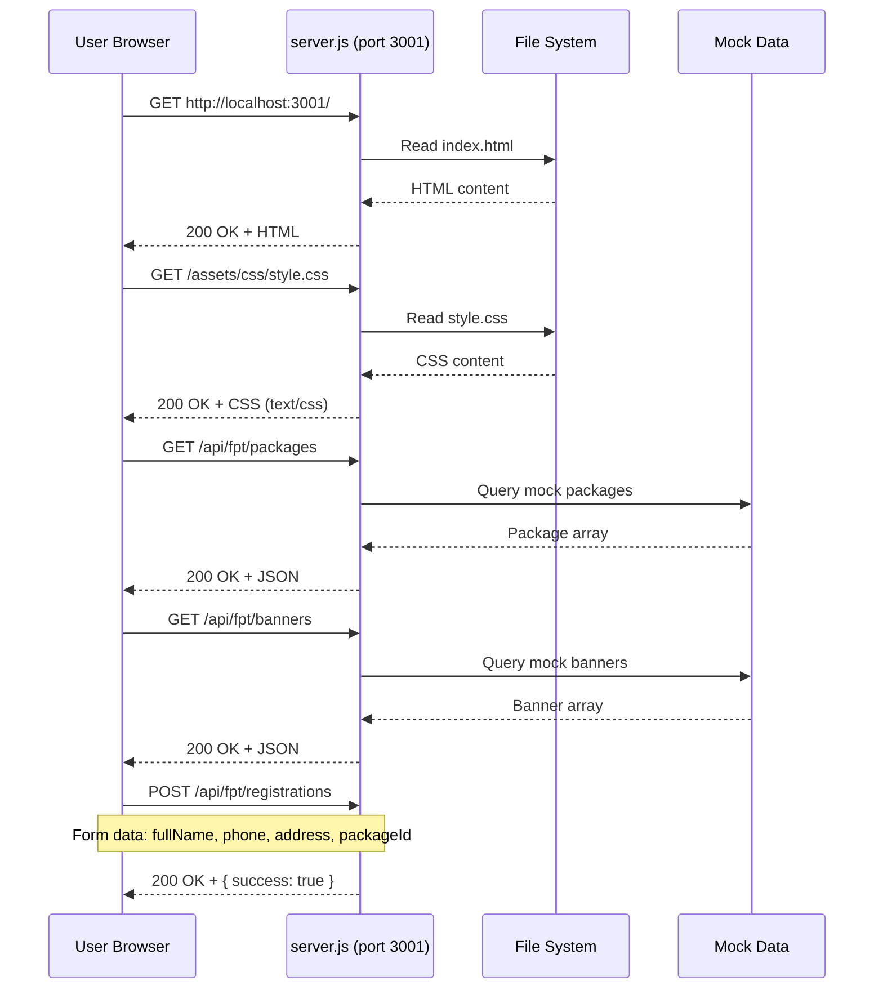
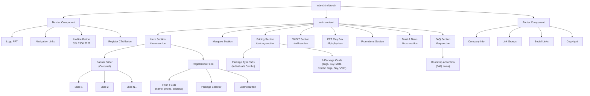
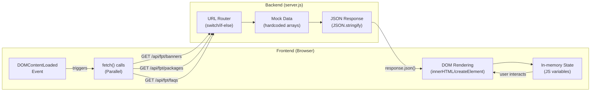
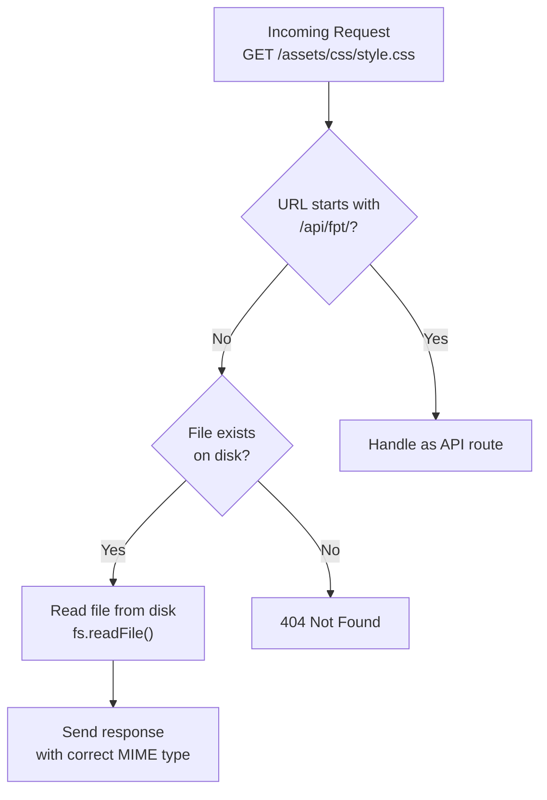
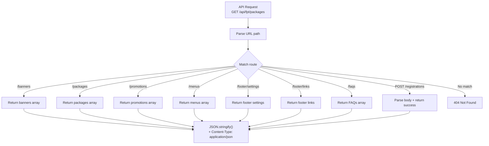
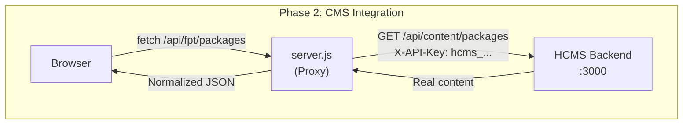
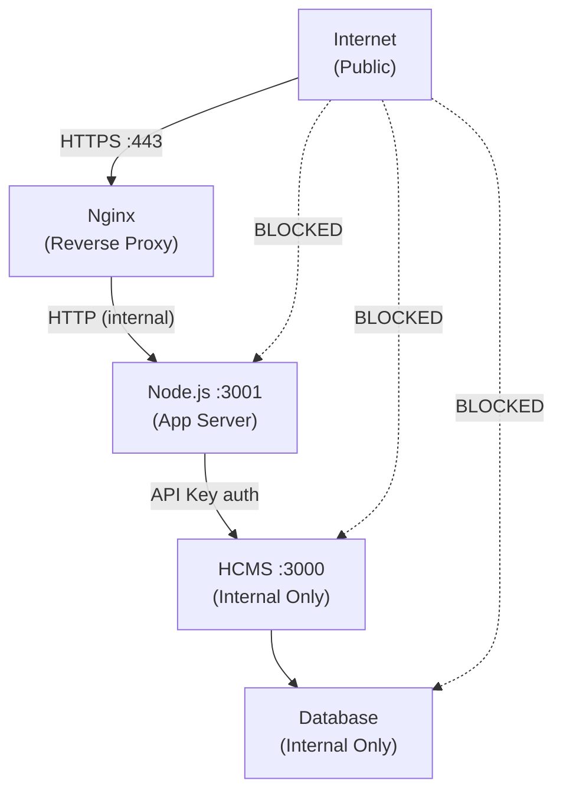

# Kiến Trúc Hệ Thống (System Architecture)

> Tài liệu mô tả kiến trúc kỹ thuật của **FPT Internet Landing Page**

---

## 1. Tổng Quan Kiến Trúc

Dự án sử dụng kiến trúc **Single-Tier Web Application** đơn giản:
- Một Node.js server phục vụ cả static files lẫn mock API
- Frontend là pure HTML/CSS/JS không có build step
- Tất cả chạy trên cùng port 3001

```mermaid
graph TB
    subgraph Client["Browser (Client)"]
        HTML["index.html\n(3541 lines)"]
        CSS["style.css\n(562 lines)"]
        JS["Inline JavaScript\nVanilla ES6+"]
        BS["Bootstrap 5.3.8"]
        FONT["Outfit Font\nGoogle Fonts CDN"]
    end

    subgraph Server["Node.js Server (port 3001)"]
        SRV["server.js\n(233 lines)"]
        STATIC["Static File Handler"]
        API["Mock API Router"]
        DATA["In-memory Mock Data"]
    end

    subgraph External["External Services"]
        GCDN["Google Fonts CDN"]
        CMS["HCMS Backend\n(localhost:3000)\nFuture Integration"]
    end

    HTML --> CSS
    HTML --> JS
    HTML --> BS
    JS -->|"fetch() API calls"| API
    HTML -->|"GET /"|  SRV
    SRV --> STATIC
    SRV --> API
    API --> DATA
    FONT --> GCDN
    CMS -.->|"Phase 2"| SRV
```

---

## 2. Luồng Request (Request Flow)



---

## 3. Sơ Đồ Component Hierarchy



---

## 4. Data Flow (Luồng Dữ Liệu)



---

## 5. Kiến Trúc server.js

### 5.1 Cấu Trúc Code

```javascript
// server.js - Kiến trúc tổng quan
const http = require('http');
const fs = require('fs');
const path = require('path');

// ==========================================
// 1. CONFIGURATION
// ==========================================
const PORT = 3001;
const HOST = 'localhost';

// ==========================================
// 2. MIME TYPES MAP
// ==========================================
const MIME_TYPES = {
  '.html': 'text/html; charset=utf-8',
  '.css':  'text/css',
  '.js':   'application/javascript',
  '.png':  'image/png',
  '.jpg':  'image/jpeg',
  '.svg':  'image/svg+xml',
  '.ico':  'image/x-icon',
  '.json': 'application/json',
};

// ==========================================
// 3. CORS HEADERS
// ==========================================
function setCORSHeaders(res) {
  res.setHeader('Access-Control-Allow-Origin', '*');
  res.setHeader('Access-Control-Allow-Methods', 'GET, POST, OPTIONS');
  res.setHeader('Access-Control-Allow-Headers', 'Content-Type, X-API-Key');
}

// ==========================================
// 4. MOCK DATA (Phase 1)
// ==========================================
const mockData = {
  banners: [...],
  packages: [...],
  promotions: [...],
  menus: [...],
  footerSettings: {...},
  footerLinks: [...],
  faqs: [...],
};

// ==========================================
// 5. HTTP SERVER (Request Handler)
// ==========================================
const server = http.createServer((req, res) => {
  setCORSHeaders(res);

  // Handle preflight OPTIONS
  if (req.method === 'OPTIONS') {
    res.writeHead(204);
    return res.end();
  }

  const url = req.url.split('?')[0]; // Strip query params

  // Route: API endpoints
  if (url.startsWith('/api/fpt/')) {
    return handleAPIRequest(req, res, url);
  }

  // Route: Static files
  return handleStaticFile(req, res, url);
});

server.listen(PORT, HOST, () => {
  console.log(`FPT Landing Page running at http://${HOST}:${PORT}`);
});
```

### 5.2 Static File Serving



### 5.3 API Route Handling



---

## 6. Frontend Rendering Pattern

### 6.1 Initialization Flow

```javascript
// Pattern: DOMContentLoaded → Parallel fetches → Render
document.addEventListener('DOMContentLoaded', async () => {
  // Parallel data fetching (không block lẫn nhau)
  const [banners, packages, faqs, menus] = await Promise.allSettled([
    fetchData('/api/fpt/banners'),
    fetchData('/api/fpt/packages'),
    fetchData('/api/fpt/faqs'),
    fetchData('/api/fpt/menus'),
  ]);

  // Render sau khi có data
  if (banners.status === 'fulfilled') renderHeroSlider(banners.value);
  if (packages.status === 'fulfilled') renderPricingCards(packages.value);
  if (faqs.status === 'fulfilled') renderFAQ(faqs.value);
  if (menus.status === 'fulfilled') renderNavigation(menus.value);
});
```

### 6.2 DOM Injection Pattern

```javascript
// Pattern: Template string + innerHTML
function renderPricingCards(packages) {
  const container = document.getElementById('pricing-grid');
  if (!container) return;

  container.innerHTML = packages.map(pkg => `
    <div class="pricing-card" data-package-id="${pkg.id}">
      <div class="pricing-card__header">
        <h3 class="pricing-card__name">${pkg.name}</h3>
      </div>
      <div class="pricing-card__price">
        <span class="pricing-tag">${pkg.price}</span>
      </div>
      <ul class="pricing-card__features">
        ${pkg.features.map(f => `<li>${f}</li>`).join('')}
      </ul>
      <button class="signup-button" data-package="${pkg.id}">
        Đăng ký ngay
      </button>
    </div>
  `).join('');
}
```

---

## 7. Cấu Hình Môi Trường

### 7.1 Environment Variables

```
# .env file
VITE_CMS_URL=http://localhost:3000    # HCMS backend URL
VITE_API_KEY=hcms_xxxxxxxxxxxx        # HCMS authentication key
```

### 7.2 Cách server.js đọc config

```javascript
require('dotenv').config();

const CMS_URL = process.env.VITE_CMS_URL || 'http://localhost:3000';
const API_KEY = process.env.VITE_API_KEY || '';

// Phase 2: Dùng để proxy requests tới CMS thật
async function fetchFromCMS(endpoint) {
  const response = await fetch(`${CMS_URL}${endpoint}`, {
    headers: { 'X-API-Key': API_KEY }
  });
  return response.json();
}
```

### 7.3 Phase 2 Architecture (Kế Hoạch)



---

## 8. Xem Xét Triển Khai (Deployment)

### 8.1 Development Setup

```
[Local Machine]
├── node server.js (port 3001)
│   ├── Serves: index.html, assets/*
│   └── API: /api/fpt/* (mock data)
└── Browser → http://localhost:3001
```

### 8.2 Production Setup (Recommended)

```
[VPS/Cloud Server]
├── Nginx (port 80/443) ← Public traffic
│   ├── SSL termination
│   ├── Static files: /assets/* (cached)
│   └── Proxy: /api/* → Node.js :3001
│
├── Node.js (port 3001, PM2 managed)
│   └── server.js (API only in production)
│
└── HCMS (port 3000, internal only)
    └── Real CMS data
```

### 8.3 Security Architecture



---

## 9. Giám Sát & Logging

### 9.1 Server Logging (Hiện tại)

```javascript
// server.js logs ra console
console.log(`[${new Date().toISOString()}] ${req.method} ${req.url} - ${statusCode}`);
```

### 9.2 Khuyến Nghị Production Logging

```javascript
// Dùng winston hoặc pino cho structured logging
const logger = require('pino')({
  level: process.env.LOG_LEVEL || 'info',
  transport: { target: 'pino-pretty' }
});

logger.info({ method: req.method, url: req.url, status: 200 }, 'Request handled');
```

---

## 10. Liên Kết

- [Deployment Guide](./deployment-guide.md)
- [Codebase Summary](./codebase-summary.md)
- [Project Overview](./project-overview-pdr.md)
